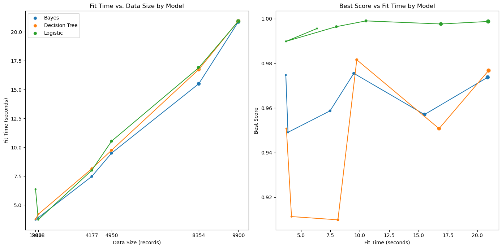
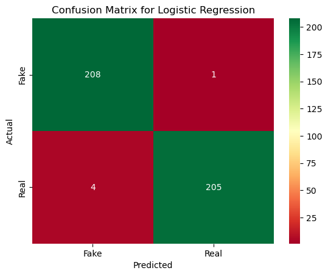

# Legitimate or Misinformative

**Author**
John Rae-Grant

## TL;DR

### Research Question
Can we classify a body of text (article, posting, email) as legitimate or misinformative?

Several single-layer classifiers and multi-level neural networks were built, tuned and evaluated.  The results are described below.

The most successful models were then loaded into a web app "Legitimizer" which allows the user to either submit new articles for classification or see the classification results for example articles from the source datasets.  

[Legitimizer UI](https://huggingface.co/spaces/johnprg/Legitimizer)
[Legitimizer App Source Repo](https://huggingface.co/spaces/johnprg/Legitimizer/tree/main)
[Primary Notebook](./Legit.ipynb)

## Problem Statement

The research question I sought to answer is "can we accurately classify a body of text (article, posting, email) as legitimate or misinformative?" I had originally intended to base this determination on metadata and semantic analysis, especially the fact density and provenance of the text, and to use Wikipedia as the source data.  In my research, I found that the labelling of articles on wikipedia was much more nuanced and subjective, and that the semantic parsing was too in depth of a specialized area to dive into.  Instead, I found several datasets of articles which had been labelled as "fake" or "real", and focused on building different NLP classifiers to see what level of accuracy could be achieved in matching the given labels.

### Rationale
There are few questions as important today as “should I believe this article”.  Indeed, with most people getting their “information” not from vetted sources, but from social media, the traditional methods of distinguishing trusted from untrusted sources have largely disappeared.  

Having access to a reasonably accurate real-time measure of an article’s legitimacy could increase public media savvy, slow down viral spread of misinformation, and even potentially guide identification of deliberate disinformers.

## Data Acquisition

### Source Datasets from Kaggle
FakeNews 
* large dataset 
* 83500 samples 
* from https://www.kaggle.com/datasets/vishakhdapat/fake-news-detection

Base 
* smaller dataset 
* 9900 samples 
* from https://www.kaggle.com/datasets/nitishjolly/news-detection-fake-or-real-dataset

Both datasets contain text samples which have been labelled as 'Real' or 'Fake'.

### Data Preprocessing/Preparation

#### Preparation
Both datasets were extremely clean and simple, with just "text" and "label" fields.  I checked for Nans and missing values to find any inconsistencies.

The datasets were used separately to train single layer models using a 20% holdback for testing, and the results were compared and then cross-validated with sample sets from the other database.

## Modeling
We experimented with several different types of single layer classifiers, doing parameter searches on each to find the most accurate model of each type

Following the selection of single layer models, we built and evaluated three diffent Multi-Level Neural Networks (MNNs) models.  The comparative results are shown below.

## Expected results
I expected that the Legitimizer would perform similarly to a spam filter.  It will perform well for articles which are more fact based and be heavily biased toward labelling articles as “misinformative”.

## Results of Single Layer Models
The results of even the single layer models were suprisingly encouraging!  All of the resulting single layer models for both datasets and multiple sample sizes scored 90% or better accuracy.  

| Model         | Size | Dataset  | Best Score | Fit Time   |
|:---------------|------|:----------|------------|:------------|
| Bayes         | 1980 | Base     | 0.974747   | 3.714640   |
| Bayes         | 2088 | FakeNews | 0.949102   | 3.897800   |
| Bayes         | 4177 | FakeNews | 0.958696   | 7.474342   |
| Bayes         | 4950 | Base     | __0.975505__   | 9.496118   |
| Bayes         | 8354 | FakeNews | 0.957055   | 15.505293  |
| Bayes         | 9900 | Base     | 0.973737   | 20.876189  |
|               |      |          |            |            |
| Decision Tree | 1980 | Base     | 0.950758   | 3.763134   |
| Decision Tree | 2088 | FakeNews | 0.911377   | 4.198360   |
| Decision Tree | 4177 | FakeNews | 0.909918   | 8.145076   |
| Decision Tree | 4950 | Base     | __0.981566__   | 9.747898   |
| Decision Tree | 8354 | FakeNews | 0.950764   | 16.745201  |
| Decision Tree | 9900 | Base     | 0.976768   | 20.956969  |
|               |      |          |            |            |
| Logistic      | 1980 | Base     | 0.995581   | 6.365607   |
| Logistic      | 2088 | FakeNews | 0.989820   | 3.731460   |
| Logistic      | 4177 | FakeNews | 0.996409   | 8.011122   |
| Logistic      | 4950 | Base     | __0.998990__   | 10.535047  |
| Logistic      | 8354 | FakeNews | 0.997606   | 16.900789  |
| Logistic      | 9900 | Base     | 0.998737   | 20.922753  |

As a further step, I used a random sample from each dataset as a test set for the models trained on the other set.  The results of those cross tests were also very encouraging.

##### Trained with Base Model - Tested with Large

| Model          | Training Score | Cross Test Score |
|:---------------|:---------------|:-----------------|
| Logistic       | 0.995581       | 0.948288         |
| Decision Tree  | 0.950758       | 0.874551         |
| Bayes          | 0.974747       | 0.923629         |

##### Trained with Large Model - Tested with Base
| Model          | Training Score | Cross Test Score |
|:---------------|:---------------|:-----------------|
| Logistic       | 0.997606       | 0.997374         |
| Decision Tree  | 0.950764       | 0.893939         |
| Bayes          | 0.957055       | 0.983030         |

The relatively poor performance of the Decision Tree models in both cross tests is symptomatic of overtraining.  Because of the outstanding results for the Large model trained Logistic Regression, I'm using that as my single layer classifier.

##### Parameters
Logistic Regression
Trained on Large model sample of 8354 records
Stemmed and Lemmatized (stop_words=stopwords.words('english'))
TfidfVectorizer(max_features=500)
C = 10.0
max_iter = 10000
penalty = 'l1'
solver = 'liblinear'

Training Accuracy: 99.76%
Cross Test:        99.74%

##### Single Layer Performance

Surprisingly, the accuracy did not increase signficantly with sample size, except for the overfit decision tree.  The confusion matrix for the winning model is shown below.  This is near perfect classification.

## Results of MNN experimentation

#### Outline of project

- [Primary Notebook](./Legit.ipynb)
- [Data Sources](./data)
- [Github Repo](https://github.com/johnprg/Legit)

##### Contact and Further Information
John Rae-Grant
john@theartofwork.com
linkedin.com/in/johnraegrant
github.com/johnprg